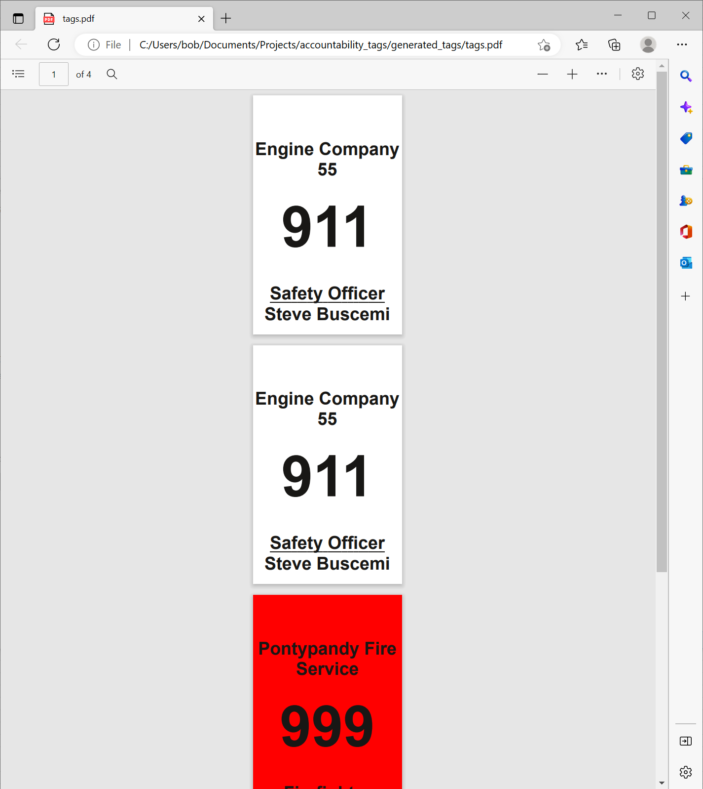
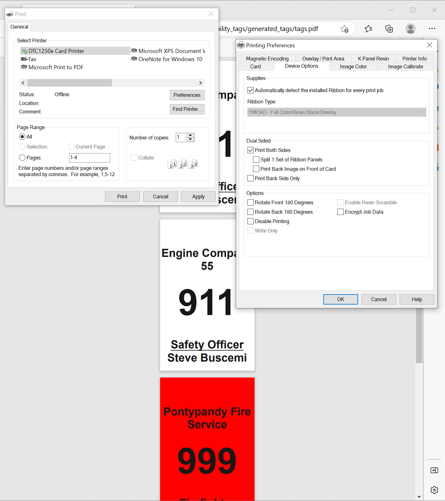

# Accountability Tags

This repository is a simple templated accountability tag system for small fire departments.

## Installation

1. Install the latest development version of [Scribus](https://w.scribus.net/wiki/index.php/1.5.8_Release) from ([SourceForge.net](https://sourceforge.net/projects/scribus/files/scribus-devel/1.5.8/scribus-1.5.8-windows-x64.exe/download))

2. Download the latest [accountability_tags release](https://github.com/feralbob/accountability_tags/releases)

## Usage

Edit the `tags_to_generate.csv` with your favourite CSV editor such as Excel, to add the required details for the tags that need to be created.

| department              | name          | number | role           | badge_colour | text_colour |
| ----------------------- | ------------- | ------ | -------------- | ------------ | ----------- |
| Engine Company 55       | Steve Buscemi | 911    | Safety Officer | White        | Black       |
| Pontypandy Fire Service | Samuel Jones  | 999    | Firefighter    | Red          | Black       |
|                         |               |        |                |              |             |

Double click the `generate_tags.bat` file - it will execute the required commands and generate `tags.pdf` in the `generated_tags` folder

Open the `tags.pdf` in any PDF reader and Print it. Be sure to set the printer to print Double Sided

## Credits

[@feralbob - Bob Shand](https://github.com/feralbob/) - [New Glasgow Fire Department, PE](https://www.facebook.com/www.ngfd.ca/)

[@kmac5 - Kevin MacPhail](https://github.com/kmac5/) - [North River Fire Department, PE](http://nrfd.ca/)
